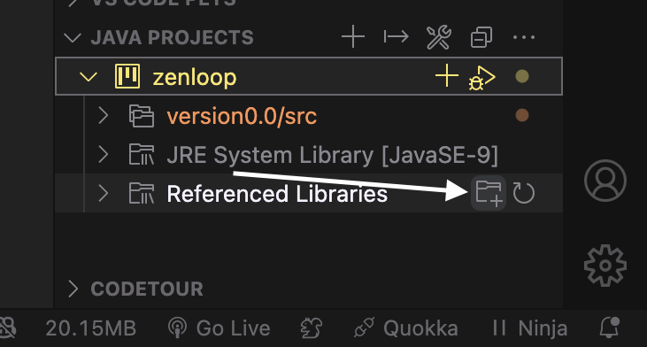
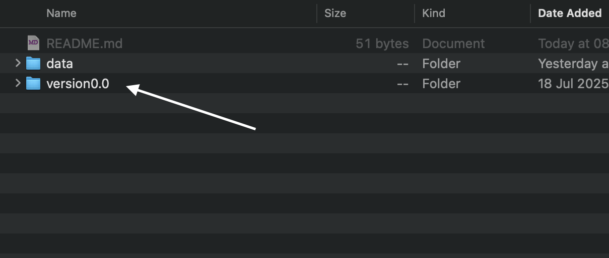
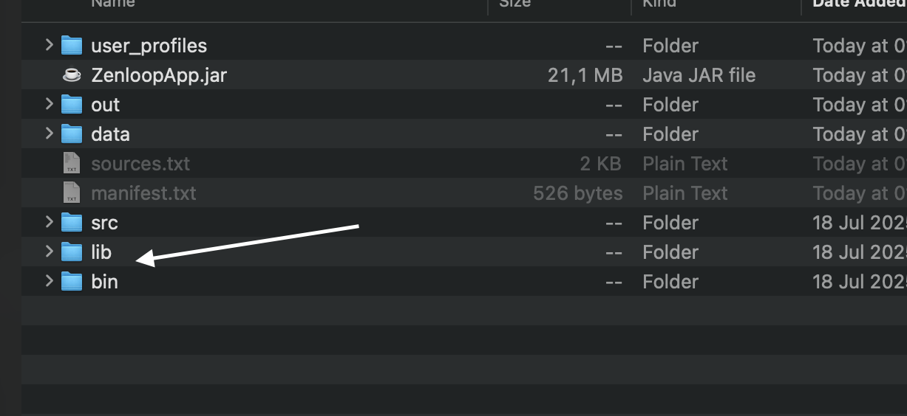
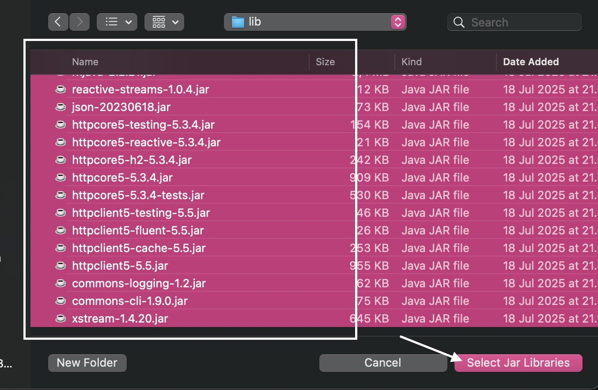

```
```
<div align="center">
  
  <p><strong>Mental Health Aplication Personalized By Yourself</strong></p>
</div>

## 🌟 About ZENLOOP
**Zenloop** is an AI-powered mental health app that helps users monitor stress levels, build daily self-care routines, and connect securely with mental health professionals. Powered by Gemini for reflective conversations and Grok for fast, real-time emotional support, Zenloop delivers a personalized, intelligent, and empathetic experience — helping you feel calmer, more focused, and emotionally balanced every day.

  
</div>

## 🖼️ Background & Motivation
**Zenloop** is a Java-based desktop app designed to help students and workers manage stress through guided relaxation, daily self-care routines, and stress tracking—featuring AI-powered chatbots (Gemini & Groq) for emotional support, and a professional dashboard for counselors.

## 💡 Key Features

### 🧠 Stress Monitoring & History
- Automatic scoring, visual stress level summaries, and chronological history tracking
- Time-filtered stress insights (weekly/monthly views) to detect behavioral changes
- Pattern alerts that notify users of sudden spikes or improvements in emotional health (Soon)

### 📔 Guided Journaling
- Mood-tagging system lets users associate feelings with each journal entry.
- End-to-end encrypted entries ensure privacy and psychological safety.
- Smart suggestions for journaling themes based on recent stress scores and events.

### 🤖 AI-Powered Chatbot Support (Powered by Gemini & Groq)
- Context-aware answers tailored to journaling history, stress levels, and time of day.
- Personalized Ai chatbot that can be your homie

### 💬 Professional Consultation
- Post-session insights summary to reinforce learning and action points.
- Real-time availability tracking for mental health professionals.


## 🧰 Technology Stack

<div align="center" padding="100px" margin="10px">
  <br><br>
  
  
  
  
  
</div>

<br />
<br />


## 🚀 Getting Started

### Prerequisites
- java 9+
- JavaFX SDK (matching your Java version)
- An IDE (e.g., IntelliJ IDEA or VSCode with JavaFX plugin)
- SceneBuilder ( for ui Editing )
- Groq API key
- Gemini API key

### Running With Jar File

#### Git clone project
```bash
# Clone the repository

git clone https://github.com/rakhaguevara/zenloop_v2.0.git

cd version0.0

```

#### Open Jar aplication
```bash
# Run jar with terminal

java -jar ZenloopApp.jar

```

<br />
<br />


## 🔧 Manual Setup

<p>IIf the JAR file cannot be opened, and your entire code got red color , please try running it manually using the following step below</p>

### Manual Running ( if jar cant open )

#### Configure Lib 

<div align="center">
  
  <p><strong>Step 1. Select Java Project and Klik + button </strong></p>
</div>

<br />
<br />

<div align="center">
  
  <p><strong>Step 2. </strong></p>
</div>

<br />
<br />

<div align="center">
  
  <p><strong>Step 3.</strong></p>
</div>

<br />
<br />

<div align="center">
  
  <p><strong>Step 4.</strong></p>
</div>

## 📂 Project Structure

```
Zenloop/
├── ZenloopApp.jar                # File .jar hasil build akhir
├── bin/                          # File .class hasil kompilasi
│   ├── app                       # Kelas utama (misal Main.java)
│   ├── controller                # Controller JavaFX
│   ├── model                     # Model/data logic
│   ├── util                      # Helper/utility classes
│   └── view                      # FXML hasil compile (opsional)
├── data/                         # Folder penyimpanan data aplikasi
│   ├── journal_archive           # Data arsip jurnal
│   ├── stress_statistic          # Statistik stres user
│   └── userData                  # Data pengguna
├── lib/                          # Semua dependency eksternal (JAR)
│   ├── gson-20230618.jar
│   ├── xstream-1.4.20.jar
│   ├── httpclient5-5.5.jar
│   ├── ... (library lainnya)
├── manifest.txt                  # File manifest untuk deklarasi Main-Class
├── out/                          # Struktur hasil build terorganisir
│   ├── app
│   ├── controller
│   ├── model
│   ├── util
│   └── view
├── resources/                    # Semua resource internal aplikasi
│   ├── fonts/                    # Font custom
│   ├── images/                   # Logo, ikon, dsb.
│   └── view/                     # FXML dan file layout lainnya
├── src/                          # Source code Java
│   ├── app/                      # Entry point (misalnya App.java / Main.java)
│   ├── controller/               # Controller JavaFX
│   ├── model/                    # Kelas representasi data & logic
│   ├── util/                     # Utility/helper classes
│   └── view/                     # (opsional) layout-related class (jika ada .java)
└── user_profiles/               # Gambar user/avatar
    └── rakha.png

```
<br />
<br />


## 👨‍💻 Contributors
This project was developed as part of the Google Solution Challenge 2025 by:
- Rakha Dzikra Guevara - Project Manager (Hacker, Hipster, Hustler)
- Hilmy Andrian S  - Hacker
- M Bintang Satriaji E - Hipster
- Prima Uziel Nasution - Hacker

## 📄 License
This project is licensed by BuzzerPDI Team

## 🙏 Acknowledgements
- Informatic Expo 2025
- All beta testers and supporters
```
